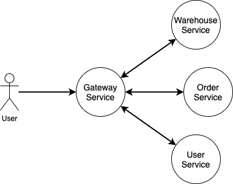

# Лабораторная работа #2


## Microservices

### Формулировка

В рамках второй лабораторной работы _по вариантам_ требуется реализовать систему, состоящую из нескольких
взаимодействующих друг с другом сервисов.

### Требования

1. Каждый сервис имеет свое собственное хранилище, если оно ему нужно. Для учебных целей можно использовать один
   instance базы данных, но каждый сервис работает _только_ со своей логической базой. Запросы между базами _запрещены_.
2. Для межсервисного взаимодействия использовать HTTP (придерживаться RESTful). Допускается использовать и другие
   протоколы, например grpc, но это требуется согласовать с преподавателем.
3. Выделить **Gateway Service** как единую точку входа и межсервисной коммуникации. Горизонтальные запросы между
   сервисами делать _нельзя_.
4. На каждом сервисе сделать специальный endpoint `GET /manage/health`, отдающий 200 ОК, он будет использоваться для
   проверки доступности сервиса (в [Github Actions](.github/workflows/classroom.yml) в скрипте проверки готовности всех
   сервисов [wait-script.sh](scripts/wait-script.sh).
   ```shell
   "$path"/wait-for.sh -t 120 "http://localhost:$port/manage/health" -- echo "Host localhost:$port is active"
   ```
6. Код хранить на Github, для сборки использовать Github Actions.
7. Gateway Service должен запускаться на порту 8080, остальные сервисы запускать на портах 8050, 8060, 8070.
8. Каждый сервис должен быть завернут в docker.
9. В [docker-compose.yml](docker-compose.yml) прописать сборку и запуск docker контейнеров.
10. В [classroom.yml](.github/workflows/classroom.yml) дописать шаги на сборку и прогон unit-тестов.
11. Для автоматических прогонов тестов в файле [autograding.json](.github/classroom/autograding.json)
    и [classroom.yml](.github/workflows/classroom.yml) заменить `<variant>` на ваш вариант.

### Пояснения

1. Для разработки можно использовать Postgres в docker, для этого нужно запустить docker compose up -d, поднимется
   контейнер с Postgres 13, и будут созданы соответствующие вашему варианту (описанные в
   файлах [schema-$VARIANT](postgres/scripts)) базы данных и пользователь `program`:`test`.
2. Для создания базы нужно прописать в [20-create-schemas.sh](postgres/20-create-databases.sh) свой вариант задания в
3. Docker Compose позволяет выполнять сборку образа, для этого нужно прописать
   блок [`build`](https://docs.docker.com/compose/compose-file/build/).
4. Горизонтальную коммуникацию между сервисами делать нельзя.
5. Интеграционные тесты можно проверить локально, для этого нужно импортировать в Postman
   коллекцию `<variant>/postman/collection.json`) и `<variant>/postman/environment.json`.



Предположим, у нас сервисы `UserService`, `OrderService`, `WarehouseService` и `Gateway`:

* На `Gateway` от пользователя `Alex` приходит запрос `Купить товар с productName: 'Lego Technic 42129`.
* `Gateway` -> `UserService` проверяем что пользователь существует и получаем `userUid` пользователя по `login: Alex`.
* `Gateway` -> `WarehouseService` получаем `itemUid` товара по `productName` и резервируем его для заказа.
* `Gateway` -> `OrderService` с `userUid` и `itemUid` и создаем заказ с `orderUid`.
* `Gateway` -> `WarehouseService` с `orderUid` и переводим товар `itemUid` из статуса `Зарезервировано` в
  статус `Заказан` и прописываем ссылку на `orderUid`.

### Прием задания

1. При получении задания у вас создается fork этого репозитория для вашего пользователя.
2. После того как все тесты успешно завершатся, в Github Classroom на Dashboard будет отмечено успешное выполнение
   тестов.

### Варианты заданий

Варианты заданий берутся исходя из формулы:
(номер в [списке группы](https://docs.google.com/spreadsheets/d/1BT5iLgERiWUPPn4gtOQk4KfHjVOTQbUS7ragAJrl6-Q)-1) % 4)+1.

1. [Flight Booking System](v1/README.md)
1. [Hotels Booking System](v2/README.md)
1. [Car Rental System](v3/README.md)
1. [Library System](v4/README.md)
